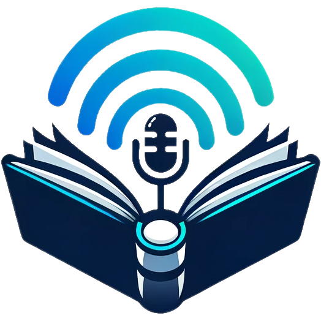

<a name="readme-top"></a>

[![Stargazers][stars-shield]][stars-url]
[![Issues][issues-shield]][issues-url]
[![MIT License][license-shield]][license-url]

<!-- PROJECT LOGO -->
<br />
<div align="center">
  <a href="https://github.com/arynsus/Storyteller">
    
  </a>

  <h3 align="center">Storyteller</h3>

  <p align="center">
    Easily convert novels into audiobooks via Microsoft Edge's Text-to-Speech functions.
    <br />
    <a href="https://github.com/arynsus/Storyteller/releases"><strong>Download release version »</strong></a>
    <br />
    <a href="https://github.com/arynsus/Storyteller/blob/master/README.zh-cn.md"><strong>中文说明书 »</strong></a>
    <br />

  </p>
</div>


<!-- ABOUT THE PROJECT -->
## About The Project

![Product Name Screen Shot][product-screenshot]

This app uses Edge's TTS service to convert .txt novels into audiobooks, with optional and customizable metadata.

IMPORTANT NOTE: This application is intended for progamming-learning only, and not for commercial use.

<p align="right">(<a href="#readme-top">back to top</a>)</p>

### Built With

[![Vue][Vue.js]][Vue-url]
[![Electron][Electron.js]][Electron-url]
[![Typescript][Typescript]][Typescript-url]
[![Arco Design][Arco]][Arco-url]
[![Tailwind Css][Tailwind]][Tailwind-url]

<p align="right">(<a href="#readme-top">back to top</a>)</p>

<!-- GETTING STARTED -->
## Getting Started

### Installation

Download the released version from [releases page](https://github.com/arynsus/Storyteller/releases) and install.

### Build from source

Alternatively, you can download the source code which offers better customizability and debugging abilities.

After cloning the repo, run:

```
# Change to app directory
cd Storyteller

# Install dependencies
npm install

# Update FFMPEG and FFPROBE binaries
# Windows x64:
copy .\ffmpeg-bin\ffmpeg\win\x64\ffmpeg.exe .\node_modules\ffmpeg-static-electron\bin\win\x64\
copy .\ffmpeg-bin\ffprobe\win\x64\ffprobe.exe .\node_modules\ffprobe-static-electron\bin\win\x64\
# macOS:
cp ./ffmpeg-bin/ffmpeg/mac/arm64/ffmpeg ./node_modules/ffmpeg-static-electron/bin/mac/arm64/
cp ./ffmpeg-bin/ffprobe/mac/arm64/ffprobe ./node_modules/ffprobe-static-electron/bin/mac/arm64/
chmod +x ./node_modules/ffmpeg-static-electron/bin/mac/arm64/
chmod +x ./node_modules/ffprobe-static-electron/bin/mac/arm64/

# Run in development mode
npm run dev

# Build
npm run build
```

<p align="right">(<a href="#readme-top">back to top</a>)</p>


<!-- USAGE EXAMPLES -->
## Usage

Here are the translations into fluent and native English, preserving the Markdown format:

1. Drag a `.txt` file to the dotted area in the main interface, or click the area to select a file to upload. Note that only files with different names will be loaded into the list.
2. Use the `Chapter Maker` in the `Window` menu to divide a full-volume text file into chapters, and import the split files into the conversion list with one click.
3. Click any row in the table to select that file, then enter metadata in the `Metadata Config` section. If the file name follows a recognizable format, the system will automatically identify chapter numbers and titles. The buttons next to the input fields for book title, author name, and cover image can apply the entered content to all `.txt` files awaiting conversion in the table.
4. To better organize the output files, use the button next to the chapter number input field to append sequence numbers to the end of the entered content. For example, after entering `2.`, clicking this button will overwrite the chapter numbers of all files in the list as `2.1`, `2.2`, `2.3`, and so on.
5. For cover images, you can drag a local file into the input box or click to upload a local file. Alternatively, enter the link to an online image file. If the image is not available or is not an image file at the time of conversion, the system will ignore the image and generate an audiobook without a cover, so be careful not to delete the original local image after starting the conversion.
6. Adjust the `TTS Config` as needed, then click `Convert`. Please note that Edge's servers will reject excessively frequent requests. Therefore, if you are not in a hurry, keep the `Concurrent jobs` and `Concurrent sections per job` at `1`. Another approach is to set these two numbers very high. Edge's servers will close the connection after the initial batch, and the conversion process will be marked as an error, but you can click `Convert` again to retry. The previous conversion progress will be retained.

<p align="right">(<a href="#readme-top">back to top</a>)</p>


<!-- ROADMAP -->
## Roadmap

- [x] Add Multi-language support.
  - [x] English
  - [x] Chinese
  - [x] Spanish
- [x] Auto-testing of Edge TTS Voice availability.
- [ ] Add other TTS options

See the [open issues](https://github.com/arynsus/Storyteller/issues) for a full list of proposed features (and known issues).

<p align="right">(<a href="#readme-top">back to top</a>)</p>


<!-- LICENSE -->
## License

Distributed under the MIT License. See `LICENSE.txt` for more information.

<p align="right">(<a href="#readme-top">back to top</a>)</p>


<!-- ACKNOWLEDGMENTS -->
## Acknowledgments

* [Electron-Vite-Vue Boilerplate](https://github.com/electron-vite/electron-vite-vue)
* [TTS-Vue](https://github.com/LokerL/tts-vue)

<p align="right">(<a href="#readme-top">back to top</a>)</p>


<!-- MARKDOWN LINKS & IMAGES -->
<!-- https://www.markdownguide.org/basic-syntax/#reference-style-links -->
[stars-shield]: https://img.shields.io/github/stars/arynsus/Storyteller?style=for-the-badge
[stars-url]: https://github.com/arynsus/Storyteller/stargazers
[issues-shield]: https://img.shields.io/github/issues/arynsus/Storyteller?style=for-the-badge
[issues-url]: https://github.com/arynsus/Storyteller/issues
[license-shield]: https://img.shields.io/github/license/arynsus/Storyteller?style=for-the-badge
[license-url]: https://github.com/arynsus/Storyteller/blob/master/LICENSE.txt

[product-screenshot]: ./screenshot.en-us.png
[Vue.js]: https://img.shields.io/badge/Vue.js-35495E?style=for-the-badge&logo=vuedotjs&logoColor=4FC08D
[Vue-url]: https://electronjs.org/
[Electron.js]: https://img.shields.io/badge/Electron-JS-47848D?style=for-the-badge&logo=electron&logoColor=white
[Electron-url]: https://vuejs.org/
[Typescript]: https://img.shields.io/badge/TypeScript-3178C6?style=for-the-badge&logo=typescript&logoColor=white
[Typescript-url]: https://www.typescriptlang.org/
[Arco]: https://img.shields.io/badge/Arco%20Design-00A6FF?style=for-the-badge
[Arco-url]: https://arco.design/
[Tailwind]: https://img.shields.io/badge/Tailwind%20CSS-38B2AC?style=for-the-badge&logo=tailwindcss&logoColor=white
[Tailwind-url]: https://tailwindcss.com/